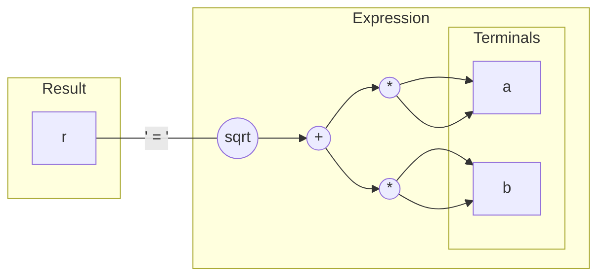

# Automatic Differentiation in Star-CCM+

## Levels of testing

We use three levels of granularity for testing code:
1. ```gtest``` for simple things
2. ```componenttest``` for sim file dependent things
3. ```startest``` for complete algorithms

Everyone will be familiar with #3, some with #1, and probably no one with #2.

### Component tests

The ```componenttest``` machinery was added by the adjoint group to test things like a term or an equation. Without this kind of testing the accuracy of adjoint computations would be a thing of fiction. This kind of testing has been critical for both correctness and for analysing performace.

To run a component test, find your favourite sim file and write a little java script:
```java
package macro;
import java.util.*;
import star.base.*;
import star.common.*;

public class TestDrvComponent extends StarMacro
{
  public void execute()
  {
    Simulation simulation = getActiveSimulation();
    NeoProperty args = new NeoProperty();

    args.put("BaseName", "StarComponentTest");
    simulation.execute("LoadLibrary", args);

    Simulation simulation = getActiveSimulation();
    
    NeoProperty properties = new NeoProperty();
    properties.put("Simulation", simulation);
    properties.put("ComponentTestName", "TestDrvEulerEquation");
    NeoProperty response = simulation.execute("RunComponentTest", properties);
  }
}
```
then run
```
./bin/starccm+ -dp -np 4 -batch ~/TestDrvEulerEquation.java ~/lemans.sim 
```

### gtests

The ```gtest``` machinery proved useful, but not so much as a means for testing but rather as a means for quickly testing. Here, only the bear minimum needs to be compiled in order to run the corresponding gtest. The other major benefit has been to treat it like a cheat sheet for using the differentiation tool.

To try the examples, below, add them to 
```
base/src/adjoint/adjoint/drvexpr/test/DrvExpressionTest.cpp
```
and evaluate them with
```cpp
TEST_F(DrvExpressionTest, main)
{
  // do stuff
}
```

To compile and run
```
cd star/base/src/
make c++
cd star/
./bin/starccm+ "-x" "DrvExpressionTest"
```

## Computing sensitivities

Calculate the derivative of the pressure drop along a pipe with respect to the inlet mean velocity.

1. Define the mean velocity (global parameter)
2. Define the inlet velocity profile (vector field field function)
3. Define the pressure drop report
4. Select the adjoint models and create a cost function associated to the report
5. Create a scalar parameter sensitivity and assocate it to the mean velocity
6. Run the primal then run the adjoint
7. Tabulate the sensitivity


## Differentiating the code

Write a function that can be used to compute hypotenuse of a right-angled triangle, and its derivative.

<table>
<tr>
<th>
Regular
</th>
<th>
Differentiable
</th>
<th>
Explicit adjoint
</th>
</tr>
<tr>
<td  valign="top">

<pre lang="cpp">
void hypot(double a,
           double b,
           double& r)
{
  auto const t0{a * a};
  auto const t1{b * b};
  auto const t2{std::sqrt(t0 + t1)};
  r = t2;
}
</pre>
</td>
<td  valign="top">

<pre lang="cpp">
template&lt;DrvMode::Option mode&gt;
void hypot(Drv&lt;mode, double&gt; a,
           Drv&lt;mode, double&gt; b,
           Drv&lt;mode, double&&gt; r)
{
  auto const t0{edrv(a * a)};
  auto const t1{edrv(b * b)};
  auto const t2{edrv(drv::sqrt(t0 + t1))};
  r = t2;
}
</pre>
</td>
<td  valign="top">

<pre lang="cpp">
template&lt;DrvMode::Option mode = ADJOINT&gt;
void hypot(Drv&lt;mode, double&gt; a,
           Drv&lt;mode, double&gt; b,
           Drv&lt;mode, double&&gt; r)
{
  auto const t0{edrv(a * a)};
  auto const t1{edrv(b * b)};
  auto const t2{edrv(drv::sqrt(t0 + t1))};

  // assignment
  t2.drv += (1) * r.drv;

  // destructors
  t1.drv += (1 / 2 * (t0.pri + t1.pri)) * t2.drv;
  t0.drv += (1 / 2 * (t0.pri + t1.pri)) * t2.drv;
  b.drv  += (2 * b.pri) * t1.drv;
  a.drv  += (2 * a.pri) * t0.drv;
}
</pre>
</td>
</tr>
</table>

### Calling the differentiable function to compute the objective

```cpp
auto constexpr mode = DrvMode::PRIMAL;

double a_pri = 3;
double b_pri = 4;

double r_pri = 0;

Drv<mode, double> a{a_pri};
Drv<mode, double> b{b_pri};
Drv<mode, double&> r{r_pri};

hypot(a, b, r);

EXPECT_EQ(r_pri, 5);
```

### Calling the differentiable function to compute the derivative

```cpp
auto constexpr mode = DrvMode::ADJOINT;

double a_pri = 3;
double b_pri = 4;

double a_drv = 0;
double b_drv = 0;

double r_drv = 1;

Drv<mode, double> a{a_pri, a_drv};
Drv<mode, double> b{b_pri, b_drv};
Drv<mode, double&> r{r_drv};

hypot(a, b, r);

EXPECT_EQ(a_drv, 0.6); //  dr/da
EXPECT_EQ(b_drv, 0.8); //  dr/db
```

## How it works

The ingredients are:
- operators, like ```operator*(x,y)``` and ```sqrt(x)```
- operator tokens, like ```Multiply``` and ```Sqrt```
- terminals, like ```Drv<mode, double>```
- results, like ```Drv<mode, double&>```
- expressions, like ```srqt(a*a + b*b)```
- expression evaluators, like the primal evaluator or the adjoint evaluator




_A key part of the design is that the expression does not provide a built-in means to compute anything, nor does its nodes hold any data, except references or copies of the terminals. All the computation is performed by an evaluator._

From the perspective of the language features and techniques, the following are essential:
- RAII; evaluation through destructor calls
- variadic types, i.e. ```template<typename... Ts>```
- universal references, i.e. ```template<typename T> auto fn(T &&v)```
- `template expressions', i.e. ```Expression<Op, Args...>```

## Fundamental difficulties

Since the adjoint is essentially the transpose of the application of the chain rule, this amounts needing a reverse-order accumulation of partial derivatives. For `pure functional' code this can be assured. However, alogorithms often branch and values are mutated; these need to be handled somehow.
