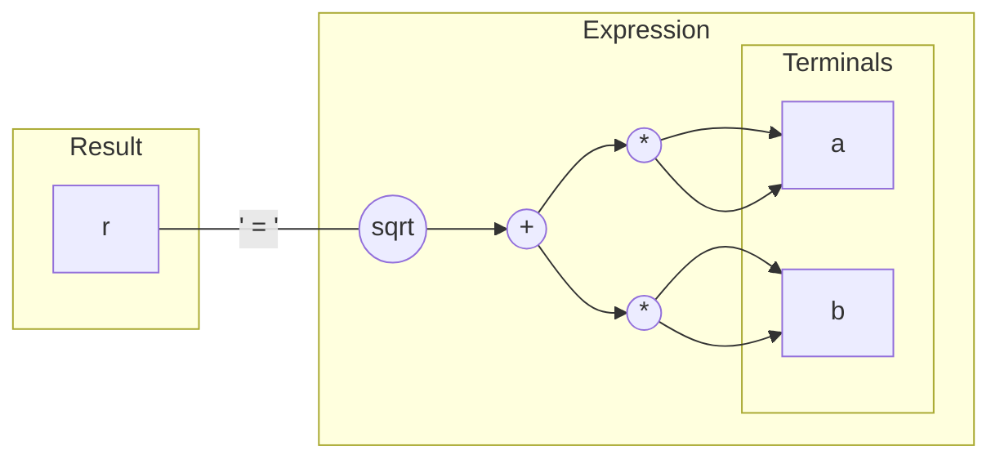

# Automatic Differentiation in Star-CCM+

To compile these examples, add

```cpp
#include "adjoint/drvexpr/DrvExpressionEngines.h"
```
from ```base/src/```


## A simple example

Write a function that can be used to compute hypotenuse of a right-angled triangle, and its derivative.

### Regular function

```cpp
void hypot(double a,
           double b,
           double& r)
{
  auto const t0{a * a};
  auto const t0{b * b};
  auto const t2{std::sqrt(t0 + t1)};
  r = t2;
}
```

### Differentiable function

```cpp
template<DrvMode::Option mode>
void hypot(Drv<mode, double> a,
           Drv<mode, double> b,
           Drv<mode, double&> r)
{
  auto const t0{edrv(a * a)};
  auto const t0{edrv(b * b)};
  auto const t2{edrv(drv::sqrt(t0 + t1))};
  r = t2;
}
```

### Calling the differentiable function to compute the objective

```cpp
auto constexpr mode = DrvMode::PRIMAL;

double a_pri = 3;
double b_pri = 4;

double r_pri = 0;

Drv<mode, double> a{a_pri};
Drv<mode, double> b{b_pri};
Drv<mode, double&> r{r_pri};

hypot(a, b, r);

assert(r_pri == 5);
```

### Calling the differentiable function to compute the derivative

```cpp
auto constexpr mode = DrvMode::ADJOINT;

double a_pri = 3;
double b_pri = 4;

double a_drv = 0;
double b_drv = 0;

double r_drv = 1;

Drv<mode, double> a{a_pri, a_drv};
Drv<mode, double> b{b_pri, b_drv};
Drv<mode, double&> r{r_drv};

hypot(a, b, r);

assert(a_drv == 0.8); //  dr/da
assert(b_drv == 0.6); //  dr/db
```

## How it works

The ingredients are:
- operators, like ```operator*(x,y)``` and ```sqrt(x)```
- operator tokens, like ```Multiply``` and ```Sqrt```
- terminals, like ```Drv<mode, double>```
- results, like ```Drv<mode, double&>```
- expressions, like ```srqt(a*a + b*b)```
- expression evaluators, like the primal evaluator or the adjoint evaluator




A key part of the design is that the expression does not provide a built-in means to compute anything, nor does its nodes hold any data, except references or copies of the terminals. All the computation is performed by an evaluator.

From the perspective of the language features and techniques, the following are essential:
- variadic types, i.e. ```template<typename... Ts>```
- universal references, i.e. ```template<typename T> auto fn(T &&v)```
- `template expressions', i.e. ```Expression<Op, Args...>```
