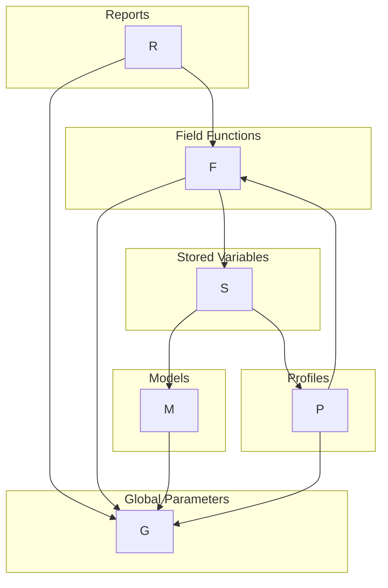
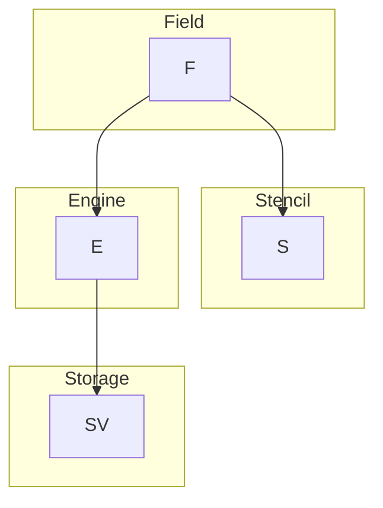
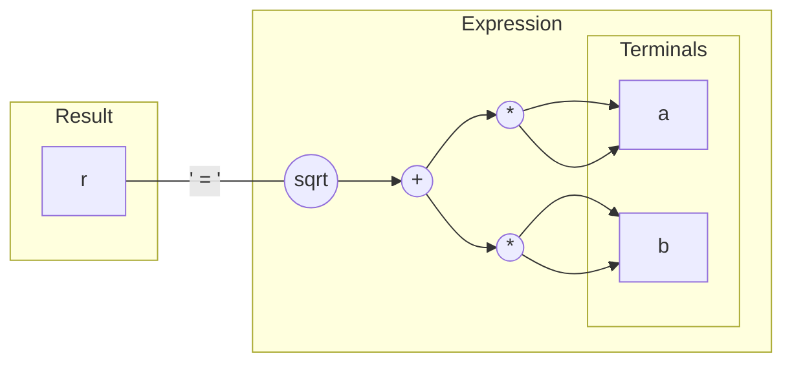
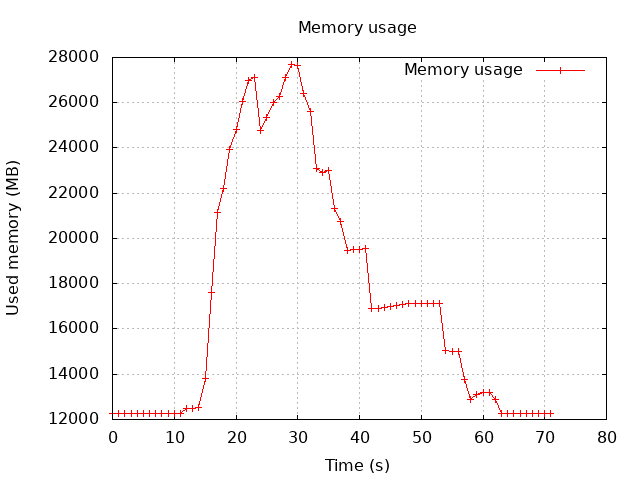
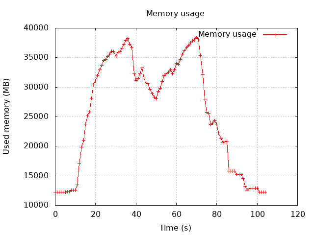

# Automatic Differentiation in Star-CCM+

## Levels of testing

We use three levels of granularity for testing code:
1. ```gtest``` for simple things
2. ```componenttest``` for sim file dependent things
3. ```startest``` for complete algorithms

Everyone will be familiar with #3, some with #1, and probably no one with #2.

### Component tests

The ```componenttest``` machinery was added by the adjoint group to test things like a term or an equation. Without this kind of testing the accuracy of adjoint computations would be a thing of fiction. This kind of testing has been critical for both correctness and for analysing performace.

To run a component test, find your favourite sim file and write a little java script:
```java
package macro;
import java.util.*;
import star.base.*;
import star.common.*;

public class TestDrvComponent extends StarMacro
{
  public void execute()
  {
    Simulation simulation = getActiveSimulation();
    NeoProperty libs = new NeoProperty();
    libs.put("BaseName", "StarComponentTest");
    simulation.execute("LoadLibrary", libs);
    
    NeoProperty properties = new NeoProperty();
    properties.put("Simulation", simulation);
    properties.put("ComponentTestName", "TestDrvEulerEquation");
    NeoProperty response = simulation.execute("RunComponentTest", properties);
  }
}
```
then run
```
./bin/starccm+ -dp -np 4 -batch ~/TestDrvComponent.java ~/lemans.sim 
```

### gtests

The ```gtest``` machinery proved useful, but not so much as a means for testing but rather as a means for quickly testing. Here, only the bear minimum needs to be compiled in order to run the corresponding gtest. The other major benefit has been to treat it like a cheat sheet for using the differentiation tool.

To try the examples, below, add them to 
```
base/src/adjoint/drvexpr/test/DrvExpressionTest.cpp
```
and evaluate them with
```cpp
TEST_F(DrvExpressionTest, main)
{
  // do stuff
}
```

To compile and run
```
cd star/base/src/
make c++
cd star/
./bin/starccm+ "-x" "DrvExpressionTest"
```

## Computing sensitivities

Calculate the derivative of the pressure drop along a pipe with respect to the inlet mean velocity.

1. Define the mean velocity (global parameter)
2. Define the inlet velocity profile (vector field field function)
3. Define the pressure drop report
4. Select the adjoint models and create a cost function associated to the report
5. Create a scalar parameter sensitivity and assocate it to the mean velocity
6. Run the primal then run the adjoint
7. Tabulate the sensitivity

### Dependency graph

Data dependencies are implicit and complex, but they need to be differentiated all the same. Adjoint evaluates the entire tree on the fly. This side steps the problems associated with time stamps and intermediate storage, but it does limit the functionality to simple stencils and no implicit interpolation of dissonante stencils.

_As a side note, I think the present state of affairs with the field function machinery should be reworked to be explicitly graphed, rather than relying on the implicit graph generated by vtables._



### Engines

Much like with the GPGPU work, engines proved to be difficult to deal with, especially expression engines. For a long time, there was the problem of how to propagate the derivative through the expression, since the expression details are hidden behind the ```operator[]``` function. This was eventually solved, and soon became a go-to technique for composing differentiable terms.

However, a new difficulty has now arisen in the wake of GPGPU support: what if an adjoint expression engine is used in a compound stencil? Surely, the ```atomic``` needs to be propagated down to all the independent engines? This appears to be the case, but it presents a very difficult implementation problem.



## Differentiating the code

Write a function that can be used to compute hypotenuse of a right-angled triangle, and its derivative.

<table>
<tr>
<th>
Regular
</th>
<th>
Differentiable
</th>
<th>
Explicit adjoint
</th>
</tr>
<tr>
<td  valign="top">

<pre lang="cpp">
void hypot(double a,
           double b,
           double& r)
{
  auto const t0{a * a};
  auto const t1{b * b};
  auto const t2{std::sqrt(t0 + t1)};
  r = t2;
}
</pre>
</td>
<td  valign="top">

<pre lang="cpp">
template&lt;DrvMode::Option mode&gt;
void hypot(Drv&lt;mode, double&gt; a,
           Drv&lt;mode, double&gt; b,
           Drv&lt;mode, double&&gt; r)
{
  auto const t0{edrv(a * a)};
  auto const t1{edrv(b * b)};
  auto const t2{edrv(drv::sqrt(t0 + t1))};
  r = t2;
}
</pre>
</td>
<td  valign="top">

<pre lang="cpp">
template&lt;DrvMode::Option mode = ADJOINT&gt;
void hypot(Drv&lt;mode, double&gt; a,
           Drv&lt;mode, double&gt; b,
           Drv&lt;mode, double&&gt; r)
{
  auto const t0{edrv(a * a)};
  auto const t1{edrv(b * b)};
  auto const t2{edrv(drv::sqrt(t0 + t1))};

  // assignment
  t2.drv += (1) * r.drv;

  // destructors
  t1.drv += (1 / 2 * (t0.pri + t1.pri)) * t2.drv;
  t0.drv += (1 / 2 * (t0.pri + t1.pri)) * t2.drv;
  b.drv  += (2 * b.pri) * t1.drv;
  a.drv  += (2 * a.pri) * t0.drv;
}
</pre>
</td>
</tr>
</table>

### Calling the differentiable function to compute the objective

```cpp
auto constexpr mode = DrvMode::PRIMAL;

double a_pri = 3;
double b_pri = 4;

double r_pri = 0;

Drv<mode, double> a{a_pri};
Drv<mode, double> b{b_pri};
Drv<mode, double&> r{r_pri};

hypot(a, b, r);

EXPECT_EQ(r_pri, 5);
```

### Calling the differentiable function to compute the derivative

```cpp
auto constexpr mode = DrvMode::ADJOINT;

double a_pri = 3;
double b_pri = 4;

double a_drv = 0;
double b_drv = 0;

double r_drv = 1;

Drv<mode, double> a{a_pri, a_drv};
Drv<mode, double> b{b_pri, b_drv};
Drv<mode, double&> r{r_drv};

hypot(a, b, r);

EXPECT_EQ(a_drv, 0.6); //  dr/da
EXPECT_EQ(b_drv, 0.8); //  dr/db
```

## How it works

The ingredients are:
- operators, like ```operator*(x,y)``` and ```sqrt(x)```
- operator tokens, like ```Multiply``` and ```Sqrt```
- terminals, like ```Drv<mode, double>```
- results, like ```Drv<mode, double&>```
- expressions, like ```srqt(a*a + b*b)```
- expression evaluators, like the primal evaluator or the adjoint evaluator




_A key part of the design is that the expression does not provide a built-in means to compute anything, nor does its nodes hold any data, except references or copies of the terminals. All the computation is performed by an evaluator._

From the perspective of the language features and techniques, the following are essential:
- RAII; evaluation through destructor calls
- variadic types, i.e. ```template<typename... Ts>```
- universal references, i.e. ```template<typename T> auto fn(T &&v)```
- `template expressions', i.e. ```Expression<Op, Args...>```

### ```const``` qualified

Since the adjoint is essentially the transpose of the application of the chain rule, this amounts needing a reverse-order accumulation of partial derivatives. For `pure functional' code this can be assured. However, alogorithms often branch and values are mutated; these need to be handled somehow.

## Fields

Much like GPGPU porting, the adjoint machinery is all to do with fields, field loops, loop bodies and variable engines. Free functions are necessary in the expression tool (i.e. ```drv::dot(x, y)```), and ought to have been used with PETE (and now StarMkl).

_The differention expression tool is a far more sophisticated expression engine than PETE or StarMkl, principally because it supports N-ary operators. This allows arbitrary functions to be part of the expression transformation, permitting functions like ```drv::weightedAve(w, a, b)```, etc. There is a rich function set which would very likely benefit regular code._

<table>
<tr>
<th>
Regular
</th>
<th>
Differentiable
</th>
</tr>
<tr>
<td  valign="top">

<pre lang="cpp">
 
void
eval(FvInterface const &iface)
{
  Field&lt;Density const, IFaceCell&gt; rho{iface, phase};
  
  Field&lt;Area&lt;3&gt; const, IFace&gt; A{iface};
  Field&lt;Velocity const, IFaceCellRecon&lt;N&gt;&gt; V{iface};

  Field&lt;FaceFlux, IFace&gt; flux{iface, phase};


  FieldLoop_begin(f, IFaceCellRecon&lt;N&gt;, iface)
  {
    auto const aV{Real(A[f](0).dot(V[f].average()))};
    flux[f].pipe() = rho[f](0) * aV;
  }
  FieldLoop_end();
}
</pre>
</td>
<td  valign="top">

<pre lang="cpp">
template&lt;DrvMode::Option mode&gt;
void
eval(FvInterface const &iface)
{
  Field&lt;Density const, IFaceCell&gt; rho{iface, phase};
  
  Drv&lt;mode, Field&lt;Area&lt;3&gt; const, IFace&gt;&gt; A{iface};
  Drv&lt;mode, Field&lt;Velocity const, IFaceCellRecon&lt;N&gt;&gt;&gt; V{iface};

  Drv&lt;mode, Field&lt;FaceFlux, IFace&gt;&gt; flux{iface, phase};


  // Field index is a function of Centroid
  DrvFieldLoop_begin(mode, f, IFaceCellRecon&lt;N&gt;, iface)
  {
    auto const aV{edrv(drv::dot(A[f].f0(), V[f].average()))};
    flux[f].pipe() = rho[f].c0() * aV;
  }
  DrvFieldLoop_end();
}
</pre>
</td>
</tr>
</table>

### Compilation

The overhead of the differentiation tool and associated field support is considerable. When a differentiated term or equation is compiled, it is typically done so for all three modes, primal, tangent and adjoint. Monitoring of compilation cost is required, particularly peak memory usage. We caused Windows VMs to have out-of-memory problems not so long ago...

 Reference Euler Equation | Differentiated Euler Equation 
:-------------------------:|:-------------------------:
  |  


## End-to-end differentiation

To compute the derivative of a function, the dependent and independent terms need to be identified. For a typical fluid dynamics simulation, dependent terms are usually reports relating to lift and drag of a wing, pressure drop in a pipe, heat transfer across a wall, etc. Ordinarily, there are few dependent terms. Independent terms are more varied. They can be boundary conditions, source terms, mesh coordinates, CAD parameters, etc. In short, anything that defines the problem.

To support the computation of these different kinds of derivative, all the major components of the solver code path needs differentiating. They are:
1. physics models, e.g. coupled flow, and all its dependent models, i.e. flow, energy, gradients, metrics etc
2. reports, e.g. force, moment, pressure drop
3. boundary and source profiles, i.e. field functions, constants
4. mesh shape parameters, i.e. CAD or morpher control points

## The vexing problem

Currently, the adjoint implementation is duplicating, or reimplementing in slightly different ways, existing code. In the long term, this probably cannot be sustained and some way of having one implementation from which all the different flavours generated code are obtained.

Consider Euler Equation: 
1. there is the `reference primal' implementation;
2. there is the differentiable implementation, from which we can generate the primal, tangent and adjoint;
3. and fairly soon there will be a GPGPU flavour of both.

Merging the codes is not an easy thing to do, neither technically nor `politically', and to date there are no examples of this.

From a technical perspective,
1. the code is stylistically different,
2. the code structure needs to be almost entirely `pure functional',
3. some code paths are ignored in the differentiated code,
4. some implementations are radically different, e.g. field functions are stateless in adjoint

From a political perspective, if a differentiable version replaced the regular version,
1. who takes priority when a feature could be supported in primal but not in adjoint?
2. who `owns' the code? Ideally the people related to the particular departments, but do they really wish to deal with the burden of adjoint?
3. what test coverage is the developer expected to do? Primal only, primal and adjoint, component tests?

In short, adjoint is an architectural nightmere, and one that will get worse the longer this problem remains unaddressed. The state of affairs is tolerated because adjoint is powerful and has be applied to many models to do all sorts of interesting things, but eventually code maintence will overwhelm development if the present course continues.
